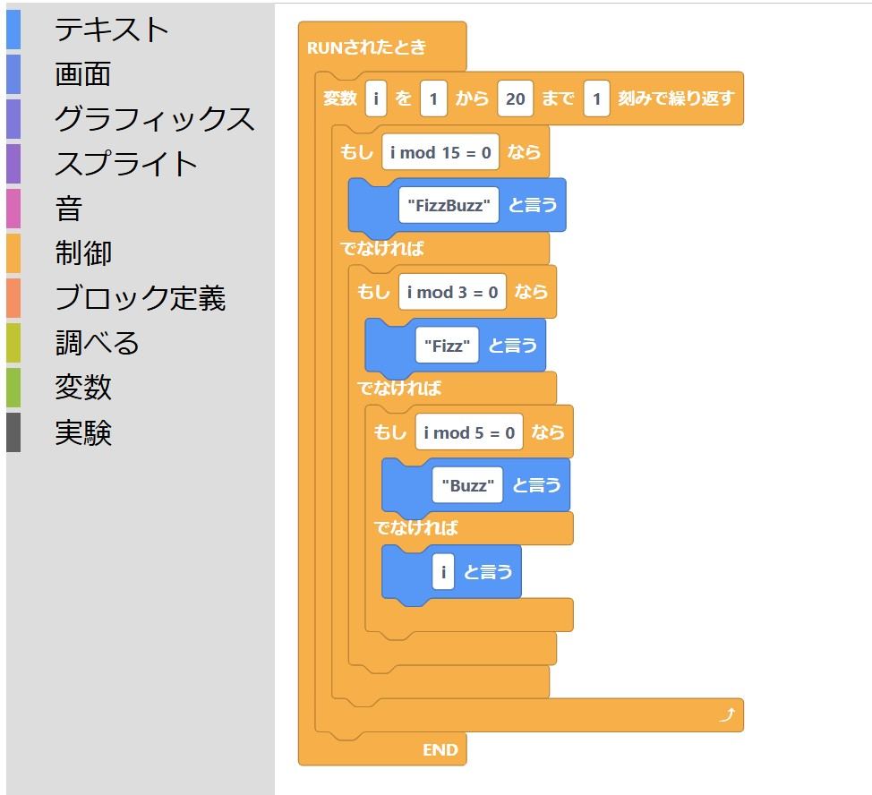
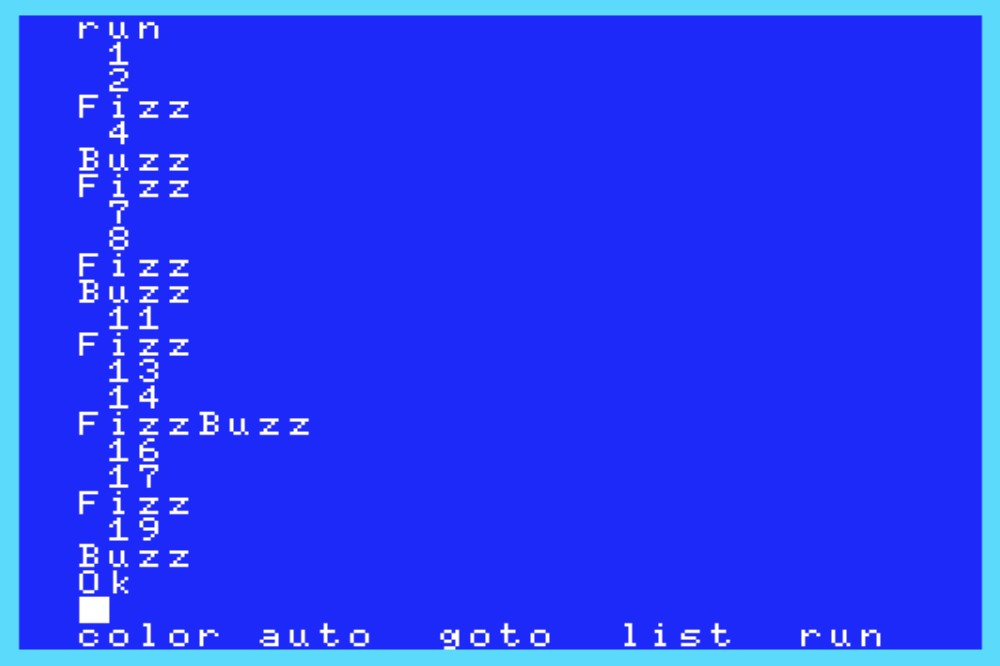
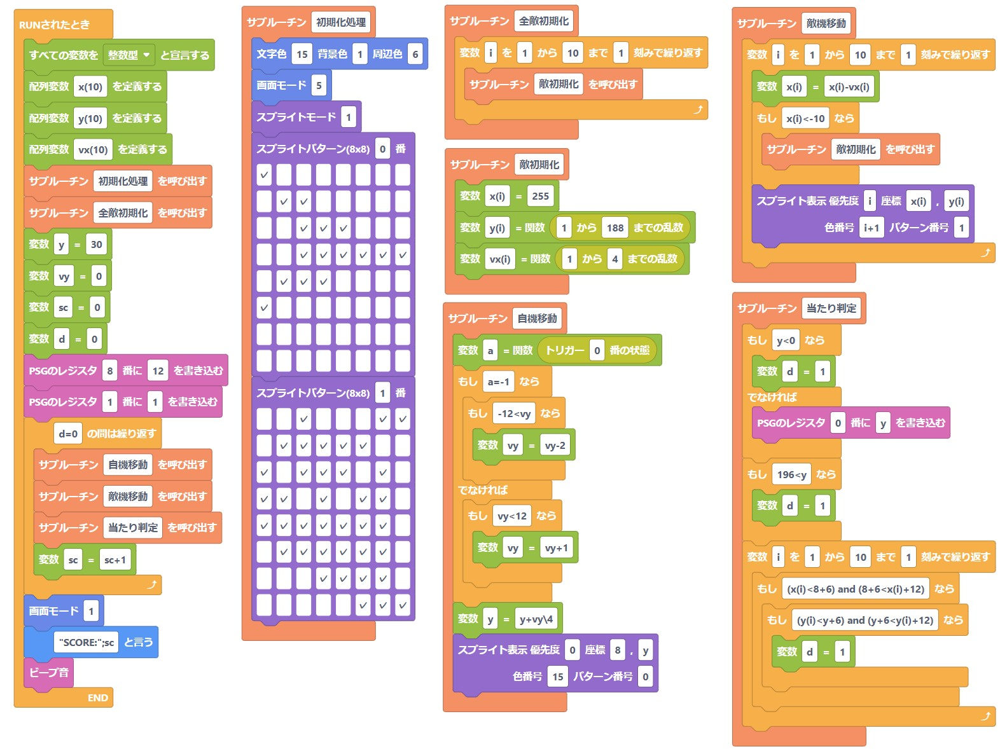
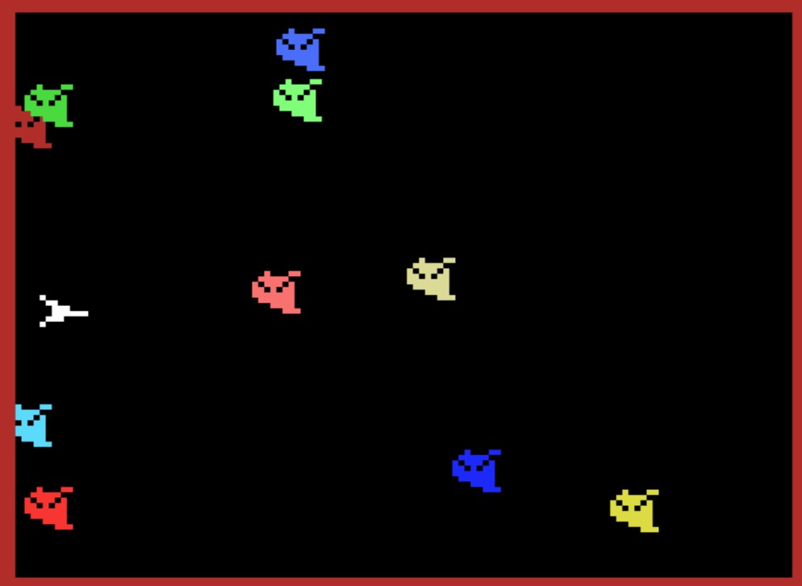

# 【助けて】BlocklyでMSX BASICのソースを作ろうと思った結果がこれだよ

## 何ができる？
GoogleのBlocklyを利用することで、MSX BASICのソースコードをブロックプログラミングで吐き出せます。

しかし、**Blocklyで各ブロックの引数の部分にリテラル値・変数・戻し値を持つ関数のどれでもドロップできるようにする方法がわからず、ネットの力を当てにすることにしました。どなたかご教示いただけますと幸いです。**

Scratch感覚でMSXのコーディングができる環境をお楽しみください。

## 画面サンプル

## できること
- ブロックプログラミングの結果をMSX BASICのソースコードとして吐き出せます。
  - 例えばクリップボードにコピーした後、WebMSXにてAlt+V→Ctrl+Vすればすぐに実行できます。
- BASICコンパイラ『MSXべーしっ君』が対応している命令は概ねカバーしています。**『MSXべーしっ君』が利用できる環境（MSX0など）なら作ったプログラムが爆速で動きます。**
- ブロックIFや条件付きループ、サブルーチンに対応しているため、**行番号に依存しないコーディング**が可能です。
  - ローカル変数が使えるわけではありません。
- ~ブロックプログラミングで単純な文法エラーが発生しないため初心者向きです。~また、見た目はScratchなので、**令和の小学生がMSX用のプログラムを書ける**かもしれません。
  - と言いたいところですが、関数をラッピングできていないためSyntax errorを抑えきれません。
  - スプライトパターンをチェックボックスで定義できます。
- 書いたそのままをコードとして出力する「即値」ブロックを用意。ブロックとして用意していない命令・関数もコーディングできます。

## 注意事項
- メイン処理は「RUNされたとき」ブロック内に書いてください。
  - 他言語のmain()相当。メイン処理は必ずこの中に記述してください。Blocklyではメイン処理以外のコードが先に出力される場合があり、それを防ぐために用意しています。
- 『MSXべーしっ君』を利用する際は、『MSXべーしっ君』の制限事項に従ってコーディングしてください。
- 「_」（アンダースコア）が2つ以上並ぶ文字列を使わないでください。内部処理でラベルを行番号に変換するために使用しています。
- oで始まる変数は使用しないでください。内部処理で使用しています。

## 実行方法
以下の3ファイルを同じ場所に置き、msx-block.htmlをブラウザで表示させてください。
- msx-block.html 画面要素用HTML
- msx-block-def.js ブロックの形状の定義・MSX BASICのコードを要求されたときの処理
- msx-block-gen.js ボタンイベントの処理

## サンプル
- FizzBuzz <a href="./sample/fizzbuzz_src.json">./sample/fizzbuzz_src.json</a>
- ワンキーゲーム <a href="./sample/one-key-game_src.json">./sample/one-key-game_src.json</a>
  - スペースキーで上昇、離すと下降。BASICだと遅いので**ぜひ『MSXべーしっ君』で**。

## 命令一覧 
括弧内はMSX BASICの相当する命令
- テキスト
  - カーソル位置(LOCATE)
  - ～と言う(PRINT)
  - ●画面の桁数(WIDTH)  
    - べーしっ君非対応
  - ファンクションキーの表示を～にする(KEY ON/OFF)
- 画面
  - すべてを消す(CLS)
  - 文字色～ 背景色～ 周辺色～ (COLOR)
  - パレット～番に赤～ 緑～ 青～ を設定する(COLOR)
  - 画面モード(SCREEN)
    - スプライトモードは別のブロックで指定します
  - VRAMのアドレス～に～を書き込む(VPOKE)
- グラフィックス
  - 表示対象(SET PAGE n)
  - 描画対象(SET PAGE ,n)
  - 線を引く(LINE)
  - 枠を描く(LINE ,B/BF)
  - 円を描く(CIRCLE)
  - 点を描く(PSET)
  - 塗りつぶす(PAINT)
  - 画像コピー(COPY)
    - ページ指定・論理演算なし
  - 画像コピー(COPY)
    - ページ指定・論理演算あり
- スプライト
  - スプライトモード(SCREEN ,n)
  - スプライト表示(PUT SPRITE)
  - スプライトパターン(8x8)(SPRITE$())
    - 8x8ドット用。チェックボックスでパターンを定義できます
  - スプライトパターン(16x16)(SPRITE$())
    - 16x16ドット用。チェックボックスでパターンを定義できます
- 音
  - ●演奏(PLAY) 
    - べーしっ君非対応
  - PSGのレジスタ ～番に ～を書き込む(SOUND)
  - ビープ音(BEEP)
- 制御
  - RUNされたとき
    - 他言語のmain()相当。メイン処理は必ずこの中に記述してください。Blocklyではメイン処理以外のコードが先に出力される場合があり、それを防ぐために用意しています
  - 注釈(REM)
  - 即値
    - 書いたそのままをコードとして出力。これを使えばMSX BASICのすべての命令が使えるはずです
  - 変数 ～を ～から ～まで ～刻みで繰り返す(FOR..NEXT)
  - ずっと
    - 無限ループ。Scratchにあるので作りました
  - ～の間は繰り返す
    - 他言語のwhile()相当
  - もし～なら～ (ブロックIF..THEN)
  - もし～なら～でなければ～ (ブロックIF..THEN..ELSE)
  - ●エラートラップ
    - 他言語のtry..catch相当。ON ERROR GOTOを隠蔽したエラートラップです。べーしっ君非対応
  - このスクリプトを止める(END)
  - プログラム～に実行を引き継ぐ(RUN”ファイル名”)
- ブロック定義
  - サブルーチン
    - GOSUBで呼び出されるサブルーチンの定義
  - サブルーチン～を呼び出す(GOSUB)
  - タイマ割り込みが発生したとき
    - ON INTERVAL割込で呼び出されるサブルーチンの定義
  - タイマ割り込みの間隔を ～/60秒に設定する(ON INTERVAL=n GOSUB)
  - タイマ割り込みを ～する(INTERVAL ON/OFF/STOP)
  - スプライトが衝突したとき
    - ON SPRITE割込で呼び出されるサブルーチンの定義
  - スプライト衝突割り込みを ～する(SPRITE ON/OFF/STOP)
  - スペースキーが押されたとき
    - ON STRIG割込で呼び出されるサブルーチンの定義
  - スペースキー割り込みを ～する(STRIG ON/OFF/STOP)
    - スペースキーのみ対応。ジョイスティックのボタンは非対応
- 調べる
  - ～？と聞いた結果を変数～に入れる(INPUT)
  - ～と聞いた結果を変数～に入れる(LINE INPUT)
  - 押されているキー(INKEY$)
  - ～文字分押された結果(INPUT$())
  - ジョイスティック ～番の方向(STICK())
  - トリガー ～番の状態(STRIG())
  - ～から～までの乱数(RND())
    - Scratchにあるので作りました。通常のRND()は即値ブロックで利用できます
  - タイマー(TIME)
  - タイマーをリセット(TIME=0)
    - Scratchにあるので作りました
- 変数
  - すべての変数を ～と宣言する(DEFINT/SNG/DBL A-Z)
  - 配列変数 ～を定義する(DIM)
  - 変数～=～(LET)
  - 変数～=～(LET)
    - 「調べる」の関数を設定できるLET

