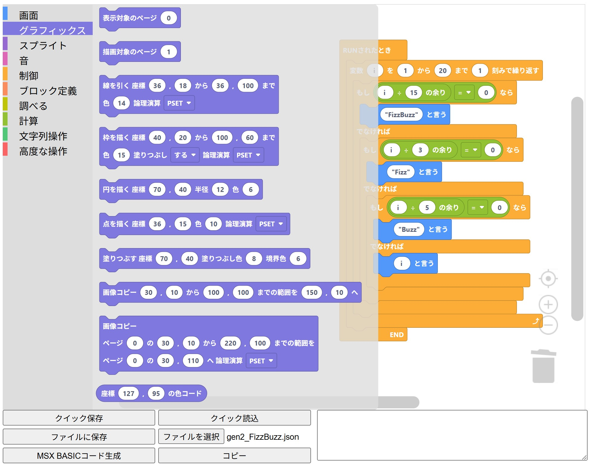
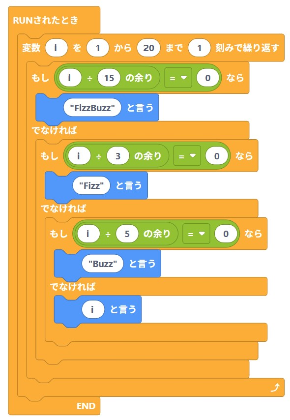
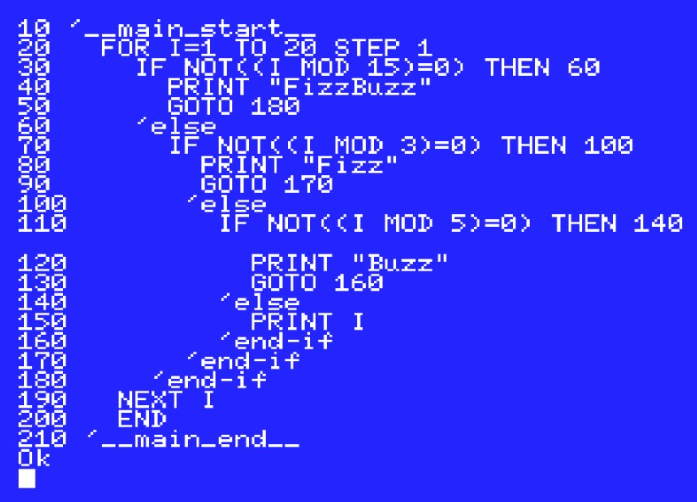
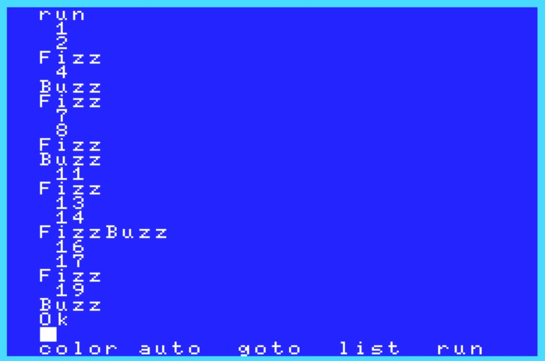
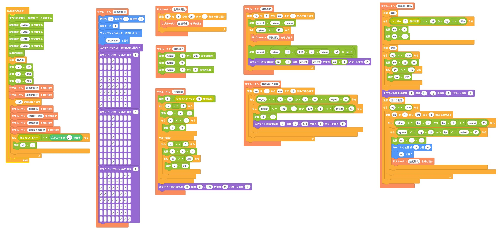
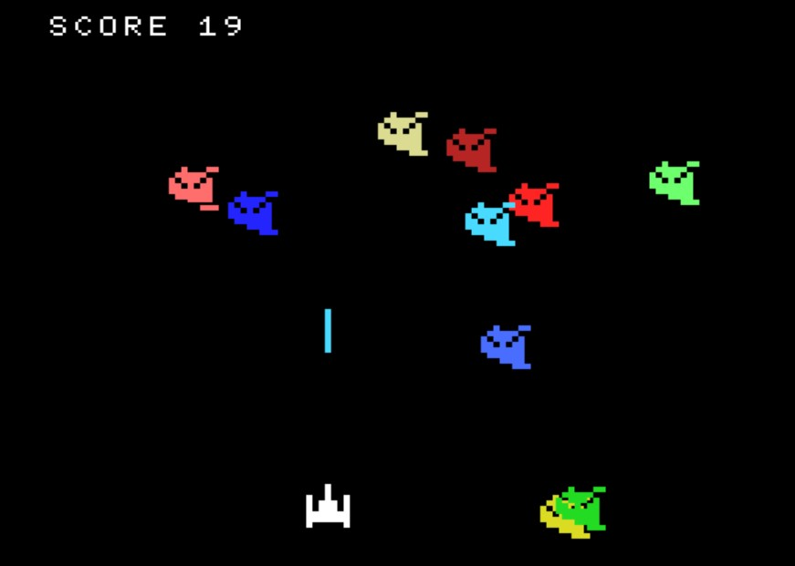

# MSXcratch - MSXをブロックプログラミングで楽しむ Gen.2

## 何ができる？
GoogleのBlocklyを利用することで、MSX BASICのソースコードをブロックプログラミングで吐き出せます。

Gen2では、引数部分に**戻し値を持つ命令**をドロップできるようになりました。
これにともない、MSX BASICの戻し値を持つ命令の多くに対応しました。

Scratch感覚でMSXのコーディングができる環境をお楽しみください。

※旧バージョンについてはGen1ディレクトリを参照ください。

## 画面サンプル

FizzBuzzのブロックプログラミング

  

シューティングゲーム

  

## できること
- ブロックプログラミングの結果をMSX BASICのソースコードとして吐き出せます。
  - 例えば、クリップボードにコピーした後、MSX0に繋がっているターミナルソフトにペーストしたり、WebMSXにAlt+V→Ctrl+Vすればすぐに実行できます。

- BASICコンパイラ『MSXべーしっ君』が対応している命令は概ねカバーしています。**『MSXべーしっ君』が利用できる環境（MSX0など）であれば、ブロックで作ったプログラムが爆速で動きます。**

- ブロックIFや条件付きループ、ラベルつきサブルーチンに対応しているため、**行番号に依存しないコーディング**が可能です。
  - ただし、サブルーチンでローカル変数が使えるわけではありません。

- ブロックプログラミングでは単純な文法エラーが発生しないため、初心者向きです。
  - 見た目はScratchなので、**プログラミング教育を受けた令和の小学生がMSX用のプログラムを書ける**かもしれません。

- コーディングがちょっとだけ楽になる機能を用意しています。
  - スプライトパターンをチェックボックスで定義できます。
  - エラー処理を簡素化できるエラートラップブロックを用意しています。
  - 書いたそのままをコードとして出力する「即値」ブロックを用意。ブロックとして用意していない命令や関数もコーディングできます。

## 注意事項
- メイン処理は「RUNされたとき」ブロック内に記述してください（他言語のmain()相当）。
  - Blocklyではメイン処理以外のコードが先に出力される場合があり、それを防ぐために用意しています。『MSXべーしっ君』にてCALL RUNによって実行する場合はDIM文を記述可能な位置が限定されるため、その対策として用意しました。

- 『MSXべーしっ君』を利用する際は、『MSXべーしっ君』の制限事項に従ってコーディングしてください。
- 「_」（アンダースコア）が2つ以上並ぶ文字列を使わないでください。内部処理でラベルを行番号に変換するために使用しています。
- oで始まる変数は使用しないでください。内部処理で使用しています。
- たいていのブロックプログラミング環境では、変数もブロックとして作成しますが、泥臭く手で変数名を打って下さい。
  - ＄つきの変数名（A＄など）のエスケープがどうしてもうまくいきませんでした（A_などに変換されてしまう）。GrokやChatGPTの言うとおりにしても解決せず、継続調査中です。
- 「令和の小学生がMSX用のプログラムを書けるかも」と前述しましたが、以下の点に留意ください。
  - MSX BASICの仕様について多少の知識が必要です（例：座標系、カラーコード、数値の範囲、文字列と数値の区別等々）。
  - MSX BASIC上で実行エラーが発生した際、発生箇所がブロック上のどの部分かを特定するにはMSX BASICの知識と開発経験が必要となります。
  - 現実的には、ピクセル環境のプログラミングに興味を持つ小学生（実際にいる）とMSX BASIC経験者がペアプログラミングする必要があるかと思われます。
    - やっとプログラミング教育の世の中が来たんだし、40年以上前にMSXを教育に使おうとした先人たちの夢を追い続けたいじゃん（例えば『パーソナル・コンピュータMSXの学習指導への利用―基礎から教室での実践まで』（平田 啓一 編集, 東京書籍, 1985）みたいな……）。
 
## 実行方法
以下の3ファイルを同じ場所に置き、msx-block.htmlをブラウザで表示させてください。
- <a href="./msx-block.html">msx-block.html</a> 画面要素用HTML
- <a href="./msx-block-def.js">msx-block-def.js</a> ブロックの形状の定義・MSX BASICのコードを要求されたときの処理
- <a href="./msx-block-gen.js">msx-block-gen.js</a> ボタンイベントの処理

## サンプル
- FizzBuzz <a href="./sample/gen2_FizzBuzz.json">gen2_FizzBuzz.json</a>
- シューティングゲーム <a href="./sample/gen2_shooting.json">gen2_shooting.json</a>
  - BASICだと遅い(R800でも)ので**ぜひ『MSXべーしっ君』で**。

## 命令一覧 
- 括弧内はMSX BASICの相当する命令
- ●で始まる命令は『MSXべーしっ君』非対応（コンパイルエラーが発生します）
- ←で始まる命令は返し値を持つ（関数、システム変数など）

- 画面
  - 画面モード(SCREEN)
    - スプライトモードは別のブロックで指定します
  - ●画面の桁数(WIDTH)  
    - べーしっ君非対応
  - ファンクションキーを表示する/しない(KEY ON/OFF)
  - 文字色～ 背景色～ 周辺色～ (COLOR)
  - すべてを消す(CLS)
  - カーソルの位置(LOCATE)
  - ～と言う(PRINT)
  - ←カーソルのX座標(POS)
  - ←カーソルのY座標(CSRLIN)
  - パレット～番に赤～ 緑～ 青～ を設定する(COLOR)
  - ←VDPのレジスタ～番の値(VDP)
  - VDPのレジスタ～番に～を書き込む(VDP)
  - ←VRAMの～番地の値(VPEEK)
  - VRAMの～番地に～を書き込む(VPOKE)

- グラフィックス
  - 表示対象のページ(SET PAGE n)
  - 描画対象のページ(SET PAGE ,n)
  - 線を引く(LINE)
  - 枠を描く(LINE ,B/BF)
  - 円を描く(CIRCLE)
  - 点を描く(PSET)
  - 塗りつぶす(PAINT)
  - 画像コピー(COPY)
    - ページ指定・論理演算なし
  - 画像コピー(COPY)
    - ページ指定・論理演算あり
  - ←座標～,～の色コード(POINT)

- スプライト
  - スプライトサイズ(SCREEN ,n)
  - スプライト表示(PUT SPRITE)
  - スプライトパターン(8x8)(SPRITE$())
    - 8x8ドット用。チェックボックスでパターンを定義できます
  - スプライトパターン(16x16)(SPRITE$())
    - 16x16ドット用。チェックボックスでパターンを定義できます

- 音
  - ●演奏(PLAY) 
    - べーしっ君非対応
  - PSGのレジスタ～番に～を書き込む(SOUND)
  - ビープ音(BEEP)

- 制御
  - RUNされたとき
    - 他言語のmain()相当。メイン処理は必ずこの中に記述してください。
  - 注釈(REM)
  - 即値
    - 書いたそのままをコードとして出力します。これを使えばMSX BASICのすべての命令が使えるはずです
  - 変数 ～を ～から ～まで ～刻みで繰り返す(FOR..NEXT)
  - ずっと
    - 無限ループ。Scratchにあるので作りました
  - ～の間は繰り返す
    - 他言語のwhile()相当
  - もし～なら～ (ブロックIF..THEN)
  - もし～なら～でなければ～ (ブロックIF..THEN..ELSE)
  - ●エラートラップ
    - 他言語のtry..catch相当。ON ERROR GOTOを隠蔽したエラートラップです。べーしっ君非対応
  - このスクリプトを止める(END)
  - プログラム～に実行を引き継ぐ(RUN”ファイル名”)

- ブロック定義
  - サブルーチン
    - GOSUBで呼び出されるサブルーチンの定義(RETURN)
    - 残念ながら、ローカル変数という概念は存在しません。
  - サブルーチン～を呼び出す(GOSUB)
  - タイマ割り込みが発生したとき
    - ON INTERVAL割込で呼び出されるサブルーチンの定義
  - タイマ割り込みの間隔を ～/60秒に設定する(ON INTERVAL=n GOSUB)
  - タイマ割り込みを ～する(INTERVAL ON/OFF/STOP)
  - スプライトが衝突したとき
    - ON SPRITE割込で呼び出されるサブルーチンの定義
  - スプライト衝突割り込みを ～する(SPRITE ON/OFF/STOP)
  - スペースキーが押されたとき
    - ON STRIG割込で呼び出されるサブルーチンの定義
  - スペースキー割り込みを ～する(STRIG ON/OFF/STOP)
    - スペースキーのみ対応。ジョイスティックのボタンは非対応

- 調べる
  - ～？と聞いた結果を変数～に入れる(INPUT)
    - 数値変数、文字列変数に対応
  - ～と聞いた結果を変数～に入れる(LINE INPUT)
    - 文字列変数に対応
  - ←押されているキー(INKEY$)
  - ←～文字分押された結果(INPUT$)
  - ←ジョイスティック ～番の方向(STICK)
  - ←トリガー ～番の状態(STRIG)
  - ←PAD ～番の状態(PAD)
  - ←PDL ～番の状態(PDL)
  - ←タイマー(TIME)
  - タイマーをリセット(TIME=0)
    - Scratchにあるので作りました

- 計算
  - すべての変数を ～と宣言する(DEFINT/SNG/DBL A-Z)
  - 配列変数 ～を定義する(DIM)
  - 変数～=～(LET)
  - ←○＋○(足し算)
  - ←○-○(引き算)
  - ←○×○(掛け算)
  - ←○÷○(割り算)
  - ←整数で○÷○(￥マークの割り算)
  - ←○÷○の余り(MOD)
  - ←○の○乗(べき乗)
  - ←○＜○,○≦○(比較)
  - ←○=○,○≠○(比較)
  - ←○＞○,○≧○(比較)
  - ←○かつ○(AND)
  - ←○または○(OR)
  - ←○と○の排他的論理和(XOR)
  - ←○ではない(NOT)
  - ←○の絶対値 ほか各種数学関数
  - 乱数の初期化(R=RND(-TIME))
  - ←～から～までの乱数(RND())
    - Scratchにあるので作りました。通常のRND()は即値ブロックで利用できます

- 文字列操作
  - ←数値～の～進数(BIN$,OCT$,HEX$)
  - ←文字コードが～の文字(CHR$)
  - ←数値～を文字列に変換(STR$)
  - ←文字～を～個つなげる(STRING$)
  - ←スペースを～個つなげる(SPACE$)
  - ←文字列～の右/左から～文字(RIGHT$,LEFT$)
  - ←文字列～の～文字目から～文字(MID$)
  - 文字列～の～文字目から～文字を～にする(MID$)
  - ←文字～の文字コード(ASC)
  - ←文字列～の長さ(LEN)
  - ←文字列～を数値に変換(VAL)
  - ←文字列～のうち文字列～の場所(INSTR)

- 高度な操作（**暴走の可能性があるので注意をもって使用してください**）
  - メモリの～番地の値(PEEK)
  - メモリの～番地に～を書き込む(POKE)
  - I/Oポートの～番の値(INP)
  - I/Oポートの～番に～を送る(OUT)
  - 機械語プログラム～番のアドレスを～番地に設定する(DEF USR)
  - ←機械語プログラム～番に引数～を与えて実行する(USR)

